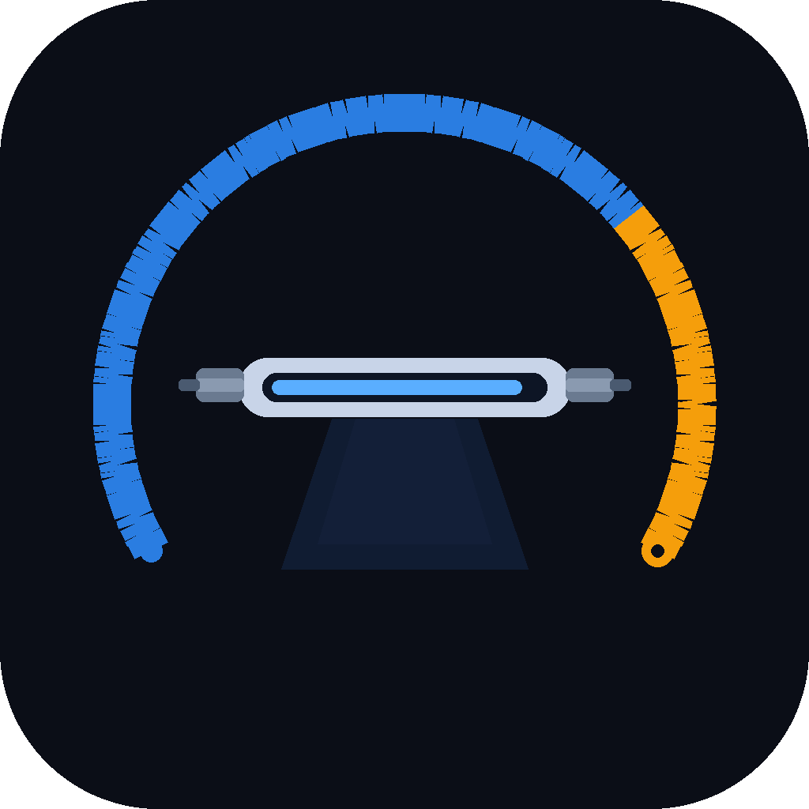

# LampWatch

**Proactive lamp hour tracking for discharge-based stage lighting fixtures.**

Discharge lamps don't fail cleanly — they degrade in color temperature and output as they age, and past their rated hours become unpredictable: sudden strikes, color shift, or outright failure mid-show. LampWatch gives you a maintenance schedule instead of reactive lamp swaps.



---

## Features

- **Fixture tracking** — log the date a lamp was changed, set average weekly runtime, and LampWatch calculates how far through the lamp's rated life you are
- **Status at a glance** — color-coded cards show hours elapsed, hours remaining, and projected replacement date for every fixture
- **Filter & sort** — quickly view only overdue, critical, or warning fixtures
- **Global hrs/week override** — set one runtime value that applies to all fixtures at once, useful when your whole rig runs the same schedule
- **Multi-unit support** — add multiple units of the same fixture type in one shot with automatic label numbering (FOH 1, FOH 2, etc.)
- **Custom fixtures** — not in the library? Add any fixture manually with your own lamp type and rated hours

### Notifications
- **macOS system notifications** — alerts fire at 80% (warning), 90% (critical), and 100%+ (overdue) of rated lamp hours
- **Slack** — paste an Incoming Webhook URL and alerts go to any channel you choose
- **Email via Resend** — simple API key setup, no SMTP configuration required
- All external notifications are **batched** (one message per check covering all affected fixtures) and **debounced** to once per threshold per 24 hours

### Background operation
- Runs silently in the **system tray** — no window needed
- **Launches on startup** by default so notifications work from the moment you log in
- Hourly lamp checks run in the background even when the app window is closed

---

## Fixture Library

LampWatch ships with a comprehensive Martin Professional discharge fixture library sourced from official martin.com specifications, covering:

- **MAC Viper series** — Profile, Performance, Wash, AirFX, Beam
- **MAC III series** — Profile, Performance, Wash, AirFX
- **MAC 2000 series** — Profile, Profile II, Performance, Performance II, Wash, Wash XB, Beam, Beam XB, E Profile, E Wash
- **MAC 1200**
- **MAC 700 series** — Profile, Wash
- **MAC 550, MAC 500**
- **MAC Axiom Hybrid**
- **MAC 600, MAC 600 E NT**
- **MAC 575 Krypton**
- **MAC TW1** (tungsten halogen)
- **MAC 300**
- **MAC 250 series** — MAC 250, 250+, 250 Wash, 250 Entour, 250 Krypton, 250 Beam
- **RUSH MH series** — MH 3 Beam, MH 4 Beam, MH 7 Hybrid, MH 11 Beam

More manufacturers coming soon.

---

## Installation

Download the latest `.dmg` from [Releases](https://github.com/YoshiBowman/Lamp-Watch/releases), open it, and drag LampWatch to your Applications folder.

macOS will ask to verify the app on first launch — click **Open** when prompted.

---

## Setup

### Adding fixtures
1. Click **+ ADD FIXTURE**
2. Select the model from the library (or check Custom Fixture for unlisted units)
3. Enter the date the lamp was last changed
4. Set average hours on per week — include rehearsals, services, and programming time
5. Optionally set a label (e.g. "FOH L1", "Truss #3") for easy identification

### Slack notifications
1. In Slack: **Apps → Incoming Webhooks → Add to Slack → choose a channel → copy the webhook URL**
2. In LampWatch: **⚙ Settings → Slack → enable → paste URL → Send Test**

### Email notifications (Resend)
1. Sign up free at [resend.com](https://resend.com)
2. Go to **API Keys → Create API Key** → copy it
3. In LampWatch: **⚙ Settings → Email → enable → paste API key → enter destination address → Send Test**

No domain verification needed to get started — Resend provides a default sender address for immediate use.

---

## Development

```bash
# Install dependencies
npm install

# Run in development
npm start

# Build DMG (macOS only)
npm run dist
```

**Stack:** Electron, React (via Babel standalone), vanilla CSS-in-JS. No bundler — single `index.html` file for the renderer.

---

## Built for

Houses of worship, touring productions, theatres, and any venue running discharge-based moving lights that needs to stay ahead of lamp maintenance.

---

*Lamp specifications sourced from official Martin Professional product documentation at martin.com.*
